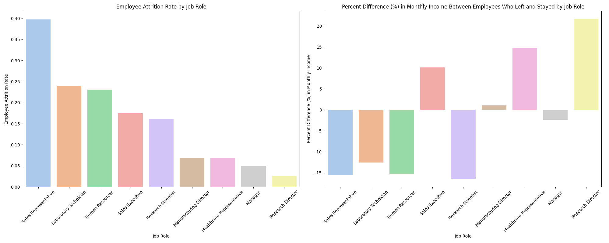
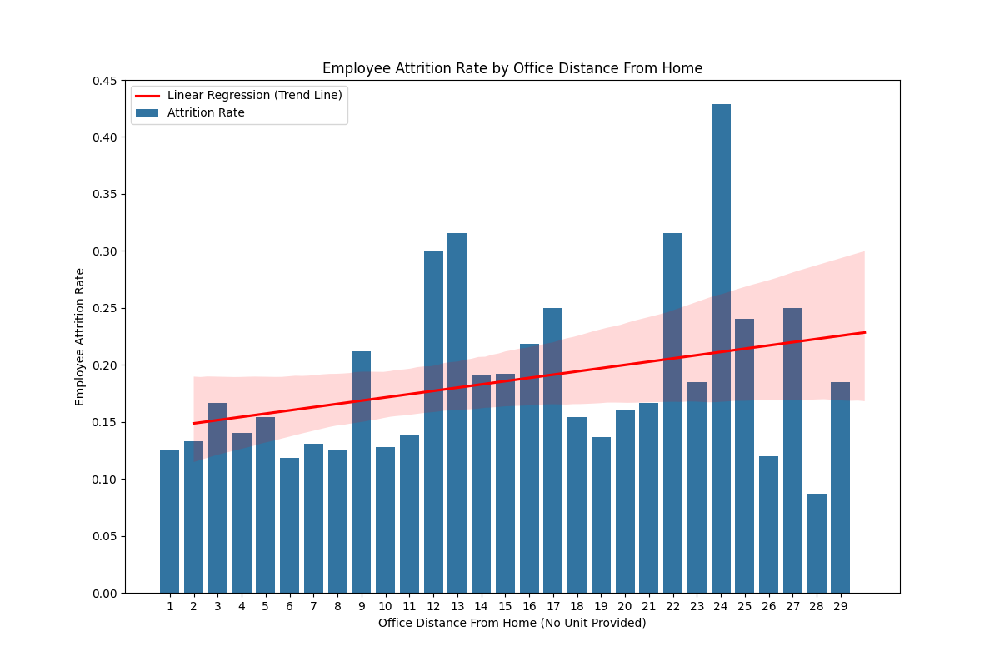
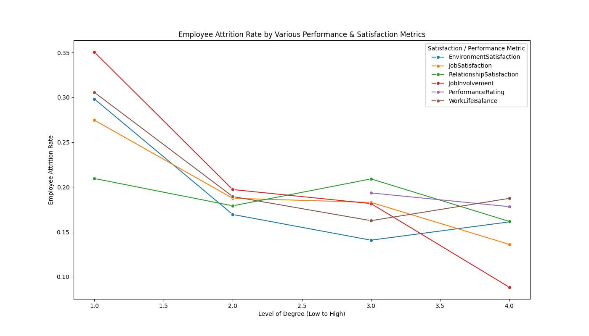
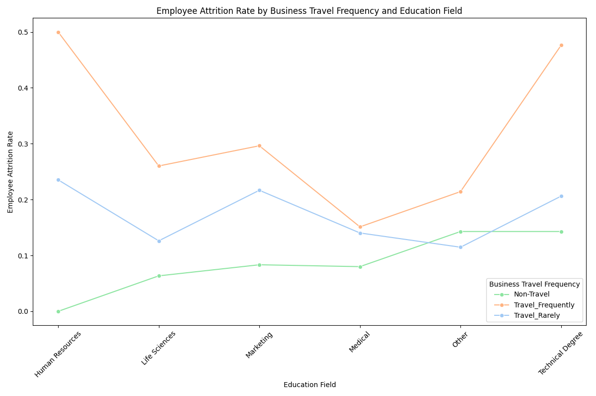

# IBM HR Analytics Employee Attrition & Performance

## Dataset

The original dataset contains 35 columns and 1470 rows on mock employee data, and is available on [Kaggle](https://www.kaggle.com/datasets/pavansubhasht/ibm-hr-analytics-attrition-dataset). The data encompasses a multitude of employee attributes, including age, attrition status, frequency of business travel, daily rate, department, distance from home, level of education attained, job role, and job satisfaction. We are interested in what factors contribute to employee attrition, how we can predict attrition, and what we can do to improve employee retention.

## Visuals

